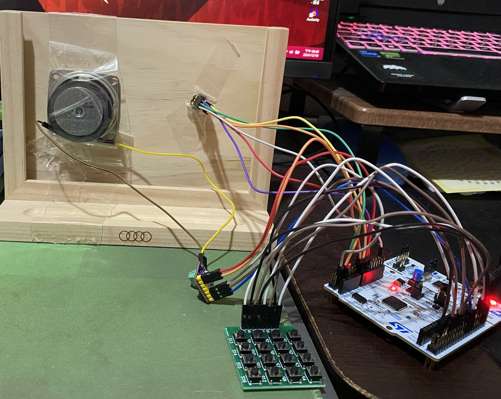

# Embedded System Design Final Project - Active Noise Cancellation System
## Introduction

This project involves implementing an Active Noise Cancellation (ANC) system suitable for wall-mounted applications and deploy the system on a resource-limited microcontroller: NUCLEO-64 stm32F446re. The experimental result show that it can achieve the noise cancellation effect in the sensing area of mems
microphone sensing. And from the result of time-frequency analysis, I found that both the fundamental
frequency and its harmonics can be cancel after turning on the active mode.
- Demo Video link: https://youtu.be/9RYAqv_bg7c?si=CvDHYNch1ibrG2lh  
- Report: Please refer to "report.pdf" for detail descriptions  

## Replicate Guide
### I.File organization in "codes" folder:

	A.Folder "Final"
		-Folder "Core"
			-Folder "Inc" (Some header files)
			-Folder "Src" 
				- "main.c" (The main code I write, this project and code are my ANC system function)
				- other system code .c(not important)	
			-Folder "Startup" (not important)
		-else folder or file (not important)

	B.Folder "Save_audio"
		-Folder "Core"
			-Folder "Inc" (Some header files)
			-Folder "Src" 
				- "main.c" (The main code I write, this project and code are for audio recording by transmit to UART)
				- other system code .c(not important)	
			-Folder "Startup" (not important)
		-else folder or file (not important)
		
	C.Python file
		"rec_audio.py"   (For receiving audio from UART and decode them save as .wav, cooperate with the Save_audio project)
		"est_sdr.py"	 (For estimating SDR value for evaluation)

	D.readme.txt
	

### II.Installation setup:
	1.Use STM32 CUBEIDE for developing, first select board F446RE
	  (After all hardware setup...)

	2.Set up I2S2 by:
		(1)Select the mode of I2S3 for transmitting
		(2)click parameter them set the sample rate to 16kHz
		(3)click DMA setting and set the bit width to half word
	
	3.Set up I2S3 by:
		(1)Select the mode of I2S3 for receiving
		(2)click parameter them set the sample rate to 16kHz
		(3)click DMA setting and set the bit width to half word

	4.Set up for the button matrix:
		(1)Set up PA8~PA11 as GPIO input
		(2)Set up PA5,PA6,PA8,PA9 as GPIO output
	
	5.Set up UART
		Setup PA2 as uart port

	6.Install DSP library
		(1)Click Middleware and Software
		(2)Click X-CUBE-ALGOBUILD
		(3)Select cmsis => DSP library 
	
	7.Generate code

	8.Paste my code in "./Final/Core/Src/main.c"  to main.c

	9.Build project and execute
			
	